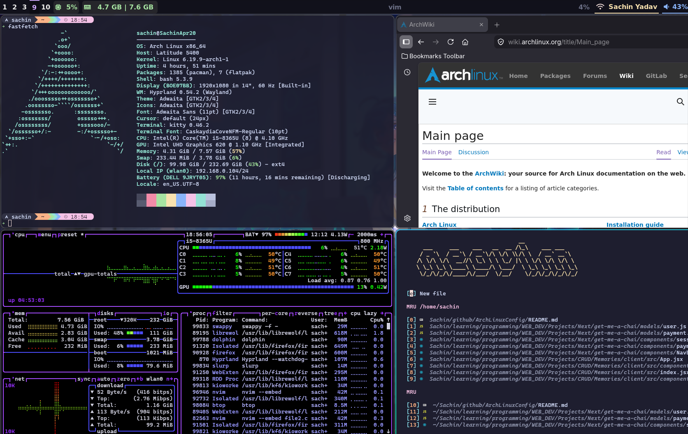

# Arch Linux Configuration

My personal dotfiles for Arch Linux with Hyprland (Wayland compositor).

## Snapshots



## Structure

- `nvim/` - Neovim config (lazy.nvim, Catppuccin theme, LSP, Telescope, etc.)
- `hypr/` - Hyprland config (waybar, hyprpaper, wallpapers)
- `waybar/` - Waybar status bar config
- `yazi/` - Yazi file manager config
- `btop/` - Btop system monitor config
- `sublime-text/` - Sublime Text settings
- `gtk-3.0/` / `gtk-4.0/` - GTK themes
- `audacity/` - Audacity config
- `blender/` - Blender config

## Setup

```bash
# Link configs to ~/.config/
ln -sf ~/path/to/ArchLinuxConfig/hypr ~/.config/hypr
ln -sf ~/path/to/ArchLinuxConfig/nvim ~/.config/nvim
ln -sf ~/path/to/ArchLinuxConfig/waybar ~/.config/waybar
# ... etc
```

## Requirements

- Hyprland
- Neovim (nightly)
- Waybar
- Kitty terminal
- Dolphin file manager
- Wofi (launcher)
- swww (wallpaper)


